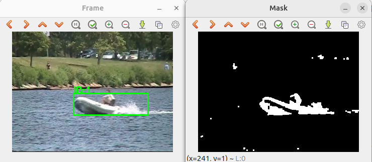

# Multi-Object Tracking using OpenCV (C++)
#Project Tags
C++ · OpenCV · Object Tracking

#Project Overview
This is a simple computer vision project that implements moving object detection and tracking using OpenCV.
It supports two types of video input:
    • Real-time input from a laptop webcam or USB camera
    • Pre-recorded video dataset

#Methodology
The system detects motion by computing frame differences to extract foreground regions.
Morphological operations (mainly closing) are then applied to fill holes and reduce noise, producing a clean binary foreground mask.
Bounding boxes are generated from the processed foreground. A threshold is used to filter out small regions, and in some cases, a region of interest (ROI) can be defined to improve robustness.
Object tracking is achieved by comparing the distance between bounding box centers in consecutive frames. If the distance is below a defined threshold, the detections are considered to belong to the same object.

#项目标签
C++  OpenCV  目标跟踪
#项目简介
 这是一个简单的计算机视觉项目，其作用是使用OpenCV库函数实现对运动目标的检测跟踪。提供了两种视频采集接口，可以使用笔记本的前置摄像头USB相机作为视频输入设备，也可以使用开源数据库。
#主要方法
通过帧之间的差别判断运动前景，然后使用形态学方法（闭运算）填补空洞并抑制噪声，这样就得到了二值化的运动前景。
然后对运动前景画框（这里要设置阈值，对于某些场景，还可以设置ROI），通过判断前后帧框的距离来判断是否属于同一个运动目标。

